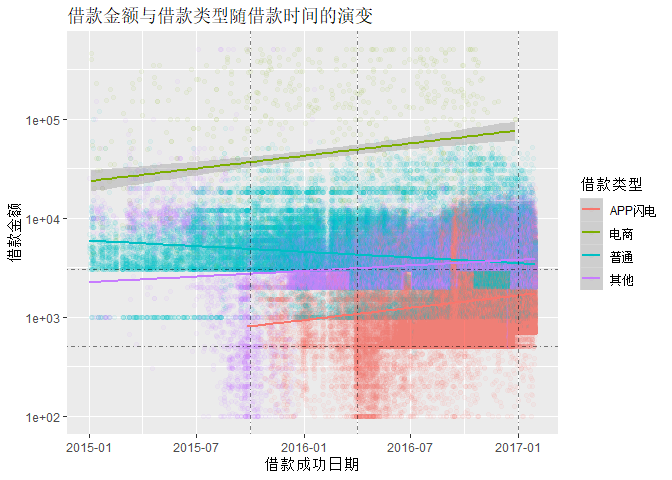
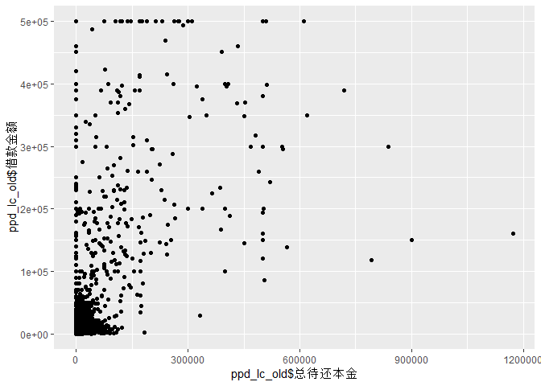

# 疯魔的时代，32万人，和他们的债务陷阱 —— 对拍拍贷借款人行为的观察
  by 过年胖十斤的大卤蛋 & 垫了三层坐垫都硌的太师椅
------------


## 简介
### 项目背景与兴趣点

首先，这是一份作业。

其次，这个数据是拍拍贷公司提供的。拍拍贷公司自认为是国内首屈一指的互联网金融公司，其撮合了无数没有良好投资渠道的个人向囊中羞涩的人放高利贷，从中抽取高额手续费盈利。公司成立于2007年，并与2017年在纽交所上市，一时风光无限。

最后，进入正题：

此数据集发布的主要目的是为拍拍贷公司手机风控人才，因此关于这个数据集的项目主要用于风控模型的建立。发布数据集的科赛网上有大量参与拍拍贷互金训练营的同学们的作业，都非常优秀。

但是，我们对于风险控制不感兴趣。这个数据集搜集自2015-2017年。这是拍拍贷公司最后冲刺，准备上市的三两年，同时也是中国在经历18年的寒冬之前，最后的萎缩到狂欢的三年。

根据[财经数字说](http://datanews.caixin.com/2015-07-08/100826978.html)整理，14年7月开始，沉寂整整6年的A股开始爬升。尽管证监会察觉股市过快上涨，重拳打击融资融券，但A股在短暂的暴跌后重新开始上涨过程。2015年1-5月，上证指数上涨超过40%，诞生了三十余位新的亿万富翁。这个过程当中，大量新股民入市的。5月28日的大幅调整也没有阻挡股市的继续上涨。不过，正如股市名言所言，2015年6月12日，股市在达到5176点，7年以来的最高点后，进入狂跌模式。

    “牛市在悲观中孕育，在怀疑中成长，在乐观中成熟，在狂喜中结束。”
  
6月19日，第一个千股跌停，当周A股跌幅13%；6月26日，两千股跌停，创业板当日下跌8.9%。6月27日开始，监管层开始宣布救市措施：从一开始的定向降准降息，到发文宣布缩紧IPO数量直至最终冻结IPO，到最终确定国家队入场救市，力度增幅之大，让人不敢相信这一系列动作是监管层两周之内的连续决策。但上述措施仅仅保住了少数权重股：至2015年7月8日，A股市场47.2%，共1312只股票停牌；不在国家队支持范围的股票大部分跌停；上证指数重新回到3500点左右，重新开始漫长的熊市征程。

股灾的影响显然是巨大的。2015年, 李总理发出了“互联网+”的创业号召；但是随着股市全面崩盘，许多基金和有能力投资的个人损失惨重，直接限制了初创企业的融资能力。彼时，O2O大战正如火如荼——百度宣布自己的使命是“连接服务”，并用200亿打响O2O保卫战，腾讯阿里紧随其后疯狂为美团，饿了么和口碑注资，巨头主推的烧钱打法成为O2O行业所有人的共识。而没有巨头傍身又将所谓“屌丝经济”奉为圭臬的中小O2O企业花钱如流水，却因股灾，后续融资无门，且这些企业相比巨头缺乏经营思路、人才储备和巨量的现金，只好纷纷倒闭（见[2015年O2O死亡榜](http://tech.163.com/15/1021/21/B6FV49TA000915BF.html))。与此同时，现在所谓的“新旧动能转换”根本没有准备完成，全国政策的主题思路还在“去库存”上，为2008年4万亿的大基建项目造成的过剩产能填坑。传统企业转型有待时日，制造业的制造水平和中国企业的创新能力的发展还仅仅处于萌芽阶段，新兴互联网企业还处于重运营抢地盘的阶段（从巨头对O2O行业的狂热就能看出来），无力支撑社会整体的经济增长。中国经济在股市带来的短暂狂喜后突然面对着巨大的下行压力。

如果我们将社会的投资主体分为政府，企业和居民三大类并分别分析其债务状况，那么截至2016年：地方政府债务负担沉重，2008年开启的大基建留下的债务尚未消化完成；国企资产负债率已经远远超过100%，而私营企业融资成本居高不下，债务关系复杂，且企业部门合债务占GDP 170%左右，全球最高，只有居民部门尚有增加杠杆的空间。[摆脱经济困局，只能寄希望于居民部门加杠杆](http://opinion.caixin.com/2016-03-01/100914302.html)，松绑房地产，刺激消费。

为了重新拉动经济，中央悍然祭出宽松货币政策，2015年下半年全面降准降息，增加货币供应量，而2015年人民币贷款量[增加11.72万亿](https://news.fang.com/open/29087156.html)。在房地产市场“去库存”和“货币化棚改”的助推下，在股市暴跌后资产贬值的恐慌之下，在优质投资标的稀缺的情况下，2016年房地产市场在经历两年的沉寂后重新开启[疯狂上涨](http://www.sohu.com/a/126243013_473260)行情，以应对内需不足和经济下行压力。[以深圳为例](http://wuyuefeng.blog.caixin.com/archives/197987)，2015年4月，深圳新房均价2.6万元/平，2016年3月达到近5.4万元/平，涨幅高达107.7%；二手房则是从3.4万元/平涨到了5.2万元/平，涨幅52.9%。相对应的，2016年，[中国居民部门杠杆率暴增5%](http://finance.sina.com.cn/stock/t/2017-04-06/doc-ifyeayzu6942394.shtml)， 而[收缩的企业部门杠杆率，不乐观的收入预期则实际意味着居民部门债务风险的上升](https://wallstreetcn.com/articles/255335)。

相对应的，房地产的重振也刺激了消费。当房地产上涨之势，拥有房产的居民名义财富出现大幅上涨，财富信心增强，刺激了高端消费；与此同时，因为房屋本身升值的空间就能够打平投资成本，因此房租保持稳定。而房价的过快上涨，[导致原本拥有购房资格的人被剥夺购房资格](http://zhang-ming.blog.caixin.com/archives/196028)，从而增加其他高端消费支出并开始寻求很难入场的房地产和贫弱无力的股市之外的投资渠道。2012年开始发展的P2P行业进入成熟和政策利好阶段，平台高利率吸引了大量手持资金的自然人或机构前来投资，构成P2P及消费金融泡沫的原动力。

与此同时，居民消费升级正式启动，投资方开始鼓吹“消费升级”概念；80/90后强烈的消费意愿和较低的收入水平之间的矛盾，被消费金融企业深耕消费场景进一步激发，而16-17年开启的消费升级大潮更是将居民消费借贷水平。据[艾瑞](http://report.iresearch.cn/report_pdf.aspx?id=3128)观察，2017年，互联网消费金融房贷规模增速达到了904%。疯狂的背后，过度授信，疯狂催收，资质审核不严的问题也直接为后续的P2P严监管和暴雷潮埋下了伏笔。

所以我们认为，这组数据见证的，是居民部门杠杆高企的三年，是面对下行压力和转型不利不得不饮鸩止渴的三年，也是可能是中国经济在彻底完成转型之前，比特币狂潮来临之前最后的，每个人都亲身参与的最后的疯狂。鼓吹消费，鼓吹享乐，狂风吹过之后，还是一地鸡毛。

因此，分析在这个疯魔的时段借款人的行为，勾勒他们的画像，可能比我们想得更有意义：它见证了一场集体的狂欢。我们将把数据集反过来看，从已有的脱敏信息倒推回基本的问题：他们是谁？他们为什么借钱？他们又多少负债。说是画像，其实我们永远也不会知道这些借款人叫什么，有没有大学学历，长得好不好看，但我们将通过探索已知的借款人信息，以期用数据勾勒出他们的面貌，他们的奋斗，他们的焦虑，他们的欲望，从而一瞥业已远去的疯狂背后，每个人都属于但又不属于每个人的故事。我们将着重探索包括但不限于以下主题的问题：
- 什么因素可能影响借款人借入的金额？谁借的更多？谁借的比较少？
- 借款人借钱时候的债务状况如何？
- 有没有借款人过度借贷以债养债？如果有？有多少？变化趋势是怎样的？
- 不同负债水平的人，借款行为有没有差异？


### 数据集基本情况说明及变量字典

##### 基本情况
我们所分析的LC表格，是拍拍贷公司提供的标的特征表，**每支标一条记录**。根据[数据集提供方的表述](https://www.kesci.com/home/dataset/58c614aab84b2c48165a262d): 这些数据集所提供数据为拍拍贷真实业务数据，时间段为2015年1月1日至2017年1月30日，但仅占真实业务数据的10%。数据集提供方不能确定抽样方法（在此我们假设抽样是完全随机的，也即样本可以反映总体的特征）。也即：
- 每一笔贷款对应一条记录；
- 我们并不清楚每条标对应的主体是否为同一个人；
- 从这个数据中推导得到的结果不反映拍拍贷平台的整体情况。

##### 变量字典
数据集共有21个字段，包括一个主键（listingid）、7个标的特征和13个成交当时的借款人信息，全部为成交当时可以获得的信息。具体的字段描述如下：

| 字段序号 | 字段名           | 字段注释                                                     |
| -------- | ---------------- | ------------------------------------------------------------ |
| 1        | ListingId        | 列表序号，为列表的唯一键。                                   |
| 2        | 借款金额         | 列表成交总金额。                                             |
| 3        | 借款期限         | 总的期数（按月计）。                                         |
| 4        | 借款利率         | 年化利率（百分数）。                                         |
| 5        | 借款成功日期     | 列表成交的日期。都在2015年1月1日以后。                       |
| 6        | 初始评级         | 列表成交时的信用评级。AAA为安全标，AA为赔标，A-F为信用等级。 |
| 7        | 借款类型         | 分为'应收安全标'，‘电商’，‘APP闪电’，‘普通’和‘其他’。        |
| 8        | 是否首标         | 该标是否为借款人首标。                                       |
| 9        | 年龄             | 借款人在该列表借款成功时的年龄。                             |
| 10       | 性别             | 该列表借款人性别。                                           |
| 11       | 手机认证         | 该列表借款人手机实名认证是否成功。                           |
| 12       | 户口认证         | 该列表借款人户口认证是否成功。                               |
| 13       | 视频认证         | 该列表借款人视频认证是否成功。                               |
| 14       | 学历认证         | 该列表借款人学历认证是否成功。成功则表示有大专及以上学历。   |
| 15       | 征信认证         | 该列表借款人征信认证是否成功。成功则表示有人行征信报告。     |
| 16       | 淘宝认证         | 该列表借款人淘宝认证是否成功。成功则表示为淘宝店主。         |
| 17       | 历史成功借款次数 | 借款人在该列表成交之前的借款成功次数。                       |
| 18       | 历史成功借款金额 | 借款人在该列表成交之前的借款成功金额。                       |
| 19       | 总待还本金       | 借款人在该列表成交之前待还本金金额。                         |
| 20       | 历史正常还款期数 | 借款人在该列表成交之前的按期还款期数。                       |
| 21       | 历史逾期还款期数 | 借款人在该列表成交之前的逾期还款期数。                       |

### 数据集结构初探

```
## Classes 'spec_tbl_df', 'tbl_df', 'tbl' and 'data.frame':	328553 obs. of  21 variables:
##  $ ListingId       : num  126541 133291 142421 149711 152141 ...
##  $ 借款金额        : num  18000 9453 27000 25000 20000 ...
##  $ 借款期限        : num  12 12 24 12 6 12 6 12 12 6 ...
##  $ 借款利率        : num  18 20 20 18 16 14 18 18 16 18 ...
##  $ 借款成功日期    : Date, format: "2015-05-04" "2015-03-16" ...
##  $ 初始评级        : chr  "C" "D" "E" "C" ...
##  $ 借款类型        : chr  "其他" "其他" "普通" "其他" ...
##  $ 是否首标        : chr  "否" "否" "否" "否" ...
##  $ 年龄            : num  35 34 41 34 24 36 27 32 33 25 ...
##  $ 性别            : chr  "男" "男" "男" "男" ...
##  $ 手机认证        : chr  "成功认证" "未成功认证" "成功认证" "成功认证" ...
##  $ 户口认证        : chr  "未成功认证" "成功认证" "未成功认证" "成功认证" ...
##  $ 视频认证        : chr  "成功认证" "未成功认证" "未成功认证" "成功认证" ...
##  $ 学历认证        : chr  "未成功认证" "未成功认证" "未成功认证" "未成功认证" ...
##  $ 征信认证        : chr  "未成功认证" "未成功认证" "未成功认证" "未成功认证" ...
##  $ 淘宝认证        : chr  "未成功认证" "未成功认证" "未成功认证" "未成功认证" ...
##  $ 历史成功借款次数: num  11 4 5 6 13 7 15 7 7 9 ...
##  $ 历史成功借款金额: num  40326 14500 21894 36190 77945 ...
##  $ 总待还本金      : num  8713 7891 11726 9703 0 ...
##  $ 历史正常还款期数: num  57 13 25 41 118 56 75 52 41 49 ...
##  $ 历史逾期还款期数: num  16 1 3 1 14 0 8 0 2 4 ...
##  - attr(*, "spec")=
##   .. cols(
##   ..   ListingId = col_double(),
##   ..   借款金额 = col_double(),
##   ..   借款期限 = col_double(),
##   ..   借款利率 = col_double(),
##   ..   借款成功日期 = col_date(format = ""),
##   ..   初始评级 = col_character(),
##   ..   借款类型 = col_character(),
##   ..   是否首标 = col_character(),
##   ..   年龄 = col_double(),
##   ..   性别 = col_character(),
##   ..   手机认证 = col_character(),
##   ..   户口认证 = col_character(),
##   ..   视频认证 = col_character(),
##   ..   学历认证 = col_character(),
##   ..   征信认证 = col_character(),
##   ..   淘宝认证 = col_character(),
##   ..   历史成功借款次数 = col_double(),
##   ..   历史成功借款金额 = col_double(),
##   ..   总待还本金 = col_double(),
##   ..   历史正常还款期数 = col_double(),
##   ..   历史逾期还款期数 = col_double()
##   .. )
```

### 探索的主要兴趣点


### 对数据集的调整与清洁
总的来说，我们的数据集十分干净，但依旧有一些不尽如人意的地方。我们进行以下调整，以更好的进行后续的数据分析。

##### 判断类型变量的文本转化为数值
观察数据集可知，手机、户口、学历、征信、视频、淘宝等认证信息为文字的“成功认证”或“未成功认证”，`是否首标`列也为文字的`是`或`否`。我们将这些列中表明“是”的标定为数字1，表明“否”的标定为数字0，以方便后续的计算和观察。


##### 将有顺序的列排序
观察数据集可知，部分列为分类变量，但被自动处理为字符串。我们对这些列进行一些调整，使其变为分类变量，并为部分列加上顺序。

```r
ppd_lc$'借款期限' <- factor(ppd_lc$'借款期限', ordered = TRUE, levels = c(1:24))
ppd_lc$'初始评级' <- factor(ppd_lc$'初始评级', ordered = TRUE, 
                        levels = c('AAA', 'AA', 'A', 'B', 'C', 'D', 'E', 'F'))
ppd_lc$'借款类型' <- factor(ppd_lc$'借款类型')
ppd_lc$'性别' <- factor(ppd_lc$'性别')
```

##### 创建新的变量：总认证数 & 逾期率
观察数据集内容可知：
- 各认证数可以累计；
- 可以计算历史单笔借款均值，以衡量借款人每一次借入的资金数额；平均数值与当前借款行为的对比可能能提供洞见
- 可以通过历史还款记录计算借款人的逾期率；逾期率不能叫逾期率，会报错；以观察借款人的守信程度
- 可以计算旧借款的偿还率；偿还率也不能叫偿还率，会报错；以观察借款人债务水平的变化
- 可以将偿还率分类：有人从来没借过钱，有人借了钱还没还就又借了钱，有人还了一部分又来借钱，有人还完了又来借钱；以观察借款人债务水平的变化
- 可以计算旧借款在借入款项后所占的比例，以观察借款人债务水平的变化；

```r
# Calculating Total of Verifications 计算总认证数
ppd_lc$'总认证数' <- ppd_lc$'手机认证' + ppd_lc$'户口认证' + ppd_lc$'学历认证' +
                     ppd_lc$'征信认证' + ppd_lc$'视频认证' + ppd_lc$'淘宝认证'
ppd_lc$'总认证数' <- as.numeric(ppd_lc$'总认证数')

# 计算历史平均借款金额
ppd_lc$'历史单笔借款均值' <- (ppd_lc$'历史成功借款金额' /
                        ppd_lc$'历史成功借款次数')
ppd_lc$'历史单笔借款均值'[is.na(ppd_lc$'历史单笔借款均值')] <- 0


# Calculating Overdue Rate 计算逾期率
ppd_lc$'逾期率' <- ppd_lc$'历史逾期还款期数' / (ppd_lc$'历史正常还款期数' + ppd_lc$'历史逾期还款期数') * 100
ppd_lc$'逾期率'[is.nan(ppd_lc$'逾期率')] <- 0
ppd_lc$'逾期率' <- as.numeric(ppd_lc$'逾期率')
ppd_lc$'OverdueRate' <- ppd_lc$'逾期率'

# Calculating Pay-off Rate 计算偿还率
ppd_lc$'PayoffRate' <- ((ppd_lc$'历史成功借款金额' - ppd_lc$'总待还本金') / ppd_lc$'历史成功借款金额') * 100
ppd_lc$'PayoffRate'[is.na(ppd_lc$'PayoffRate')] <- -1

# Categorizing Pay-off Rates 构建还款进度分类
ppd_lc$'PayoffCate' <- cut(ppd_lc$'PayoffRate', 
                           breaks = c(-2, -1, 0, 99, 100), 
                           labels = c("从未借款", "未开始归还", "部分还清", "全部还清"), 
                           right = TRUE)
ppd_lc$'PayoffCate' <- factor(ppd_lc$'PayoffCate', 
                              ordered = TRUE, 
                              levels = c("从未借款", "未开始归还", "部分还清", "全部还清"))

# Categorizing Whether has Unpaid loans when applying 借款时是否有未偿清负债
ppd_lc$Unpaid_Total <- ppd_lc$'总待还本金'
ppd_lc$UnpaidCate <- NA
ppd_lc$UnpaidCate <- ifelse(ppd_lc$Unpaid_Total == 0, "无欠款", "有欠款")
ppd_lc$'UnpaidCate' <- factor(ppd_lc$'UnpaidCate', ordered = TRUE)

# Calculating Old Loan Percentage 计算待还款项占总待还金额比例
ppd_lc$'OldLoanPCT' <- (ppd_lc$'总待还本金' / 
                          (ppd_lc$'借款金额' + ppd_lc$'总待还本金')) * 100
```

##### 将转化为数值类型的认证数据转化为分类

```r
ppd_lc$'手机认证' <- factor(ppd_lc$'手机认证')
ppd_lc$'户口认证' <- factor(ppd_lc$'户口认证')
ppd_lc$'学历认证' <- factor(ppd_lc$'学历认证')
ppd_lc$'征信认证' <- factor(ppd_lc$'征信认证')
ppd_lc$'视频认证' <- factor(ppd_lc$'视频认证')
ppd_lc$'淘宝认证' <- factor(ppd_lc$'淘宝认证')
ppd_lc$'是否首标' <- factor(ppd_lc$'是否首标')
```

##### 将数据集拆分为新用户和老用户两个数据集 
我们将只对老用户进行分析，因为老用户留下的记录更多

```r
ppd_lc_old <- subset(ppd_lc, ppd_lc$"是否首标" == 0)
ppd_lc_new <- subset(ppd_lc, ppd_lc$"是否首标" == 1)
```

### 在已经探究的特性中，是否存在任何异常分布？
##### 空值检验

```
##  /\     /\
## {  `---'  }
## {  O   O  }
## ==>  V <==  No need for mice. This data set is completely observed.
##  \  \|/  /
##   `-----'
```

<!-- -->

```
##        ListingId 借款金额 借款期限 借款利率 借款成功日期 初始评级 借款类型
## 328553         1        1        1        1            1        1        1
##                0        0        0        0            0        0        0
##        是否首标 年龄 性别 手机认证 户口认证 视频认证 学历认证 征信认证
## 328553        1    1    1        1        1        1        1        1
##               0    0    0        0        0        0        0        0
##        淘宝认证 历史成功借款次数 历史成功借款金额 总待还本金
## 328553        1                1                1          1
##               0                0                0          0
##        历史正常还款期数 历史逾期还款期数 总认证数 历史单笔借款均值 逾期率
## 328553                1                1        1                1      1
##                       0                0        0                0      0
##        OverdueRate PayoffRate PayoffCate Unpaid_Total UnpaidCate
## 328553           1          1          1            1          1
##                  0          0          0            0          0
##        OldLoanPCT  
## 328553          1 0
##                 0 0
```

##### 列值基本描述检验

```
##    ListingId           借款金额         借款期限         借款利率   
##  Min.   :  126541   Min.   :   100   12     :215330   Min.   : 6.5  
##  1st Qu.:11908871   1st Qu.:  2033   6      : 84486   1st Qu.:20.0  
##  Median :19523251   Median :  3397   9      : 10769   Median :20.0  
##  Mean   :19079479   Mean   :  4424   10     :  5472   Mean   :20.6  
##  3rd Qu.:26298621   3rd Qu.:  5230   11     :  5351   3rd Qu.:22.0  
##  Max.   :32819531   Max.   :500000   3      :  1993   Max.   :24.0  
##                                      (Other):  5152                 
##   借款成功日期           初始评级         借款类型      是否首标  
##  Min.   :2015-01-01   D      :134860   APP闪电:112079   0:241090  
##  1st Qu.:2016-05-08   C      :131705   电商   :  1069   1: 87463  
##  Median :2016-09-11   B      : 33188   普通   :118103             
##  Mean   :2016-08-05   E      : 17027   其他   : 97302             
##  3rd Qu.:2016-12-01   A      : 10284                              
##  Max.   :2017-01-30   F      :  1489                              
##                       (Other):     0                              
##       年龄       性别        手机认证   户口认证   视频认证   学历认证  
##  Min.   :17.00   男:221946   0:205546   0:318448   0:310052   0:214429  
##  1st Qu.:24.00   女:106607   1:123007   1: 10105   1: 18501   1:114124  
##  Median :28.00                                                          
##  Mean   :29.14                                                          
##  3rd Qu.:33.00                                                          
##  Max.   :56.00                                                          
##                                                                         
##  征信认证   淘宝认证   历史成功借款次数  历史成功借款金额 
##  0:318947   0:327401   Min.   :  0.000   Min.   :      0  
##  1:  9606   1:  1152   1st Qu.:  0.000   1st Qu.:      0  
##                        Median :  2.000   Median :   5000  
##                        Mean   :  2.323   Mean   :   8786  
##                        3rd Qu.:  3.000   3rd Qu.:  10355  
##                        Max.   :649.000   Max.   :7405926  
##                                                           
##    总待还本金      历史正常还款期数   历史逾期还款期数     总认证数     
##  Min.   :      0   Min.   :   0.000   Min.   : 0.0000   Min.   :0.0000  
##  1st Qu.:      0   1st Qu.:   0.000   1st Qu.: 0.0000   1st Qu.:0.0000  
##  Median :   2542   Median :   5.000   Median : 0.0000   Median :1.0000  
##  Mean   :   3722   Mean   :   9.948   Mean   : 0.4233   Mean   :0.8416  
##  3rd Qu.:   5447   3rd Qu.:  13.000   3rd Qu.: 0.0000   3rd Qu.:1.0000  
##  Max.   :1172653   Max.   :2507.000   Max.   :60.0000   Max.   :6.0000  
##                                                                         
##  历史单笔借款均值     逾期率        OverdueRate       PayoffRate    
##  Min.   :     0   Min.   :  0.00   Min.   :  0.00   Min.   : -1.00  
##  1st Qu.:     0   1st Qu.:  0.00   1st Qu.:  0.00   1st Qu.: -1.00  
##  Median :  2500   Median :  0.00   Median :  0.00   Median : 34.54  
##  Mean   :  2812   Mean   :  2.85   Mean   :  2.85   Mean   : 35.13  
##  3rd Qu.:  4000   3rd Qu.:  0.00   3rd Qu.:  0.00   3rd Qu.: 55.67  
##  Max.   :500000   Max.   :100.00   Max.   :100.00   Max.   :100.00  
##                                                                     
##       PayoffCate      Unpaid_Total      UnpaidCate       OldLoanPCT   
##  从未借款  : 87463   Min.   :      0   无欠款:101301   Min.   : 0.00  
##  未开始归还:  1488   1st Qu.:      0   有欠款:227252   1st Qu.: 0.00  
##  部分还清  :225755   Median :   2542                   Median :43.85  
##  全部还清  : 13847   Mean   :   3722                   Mean   :39.85  
##                      3rd Qu.:   5447                   3rd Qu.:68.87  
##                      Max.   :1172653                   Max.   :99.75  
## 
```
我们看到，历史成功借款次数有非常夸张的649次，借款金额有非常夸张的50万，历史成功借款金额有夸张的740万，总待还本金有一个人有117万之巨，历史成功借款金额也有74万。逾期率也有100%的。这些极值需要我们调查一下。

##### 最大借款金额

```
## # A tibble: 56 x 30
##    ListingId 借款金额 借款期限 借款利率 借款成功日期 初始评级 借款类型
##        <dbl>    <dbl> <ord>       <dbl> <date>       <ord>    <fct>   
##  1   3097341   500000 1             6.5 2015-07-06   A        其他    
##  2   3220201   500000 1            10   2015-07-15   A        其他    
##  3   3250931   500000 1            10   2015-07-17   A        其他    
##  4   3616281   500000 3            10   2015-08-12   A        其他    
##  5   3628471   500000 3            10   2015-08-12   A        其他    
##  6   3659691   500000 2            10   2015-08-14   A        其他    
##  7   3840301   500000 1            10   2015-08-25   A        其他    
##  8   3981541   500000 1             9   2015-09-02   A        其他    
##  9   4429331   500000 6            14   2015-09-25   B        电商    
## 10   4434731   500000 6            14   2015-09-28   B        电商    
## # ... with 46 more rows, and 23 more variables: 是否首标 <fct>,
## #   年龄 <dbl>, 性别 <fct>, 手机认证 <fct>, 户口认证 <fct>,
## #   视频认证 <fct>, 学历认证 <fct>, 征信认证 <fct>, 淘宝认证 <fct>,
## #   历史成功借款次数 <dbl>, 历史成功借款金额 <dbl>, 总待还本金 <dbl>,
## #   历史正常还款期数 <dbl>, 历史逾期还款期数 <dbl>, 总认证数 <dbl>,
## #   历史单笔借款均值 <dbl>, 逾期率 <dbl>, OverdueRate <dbl>,
## #   PayoffRate <dbl>, PayoffCate <ord>, Unpaid_Total <dbl>,
## #   UnpaidCate <ord>, OldLoanPCT <dbl>
```

##### 最大借款金额-摘要

```
##    ListingId           借款金额        借款期限     借款利率    
##  Min.   : 3097341   Min.   :5e+05   6      :35   Min.   : 6.50  
##  1st Qu.: 5116334   1st Qu.:5e+05   1      :10   1st Qu.:13.00  
##  Median : 9799516   Median :5e+05   3      : 9   Median :14.00  
##  Mean   :10710709   Mean   :5e+05   2      : 1   Mean   :13.01  
##  3rd Qu.:15932198   3rd Qu.:5e+05   12     : 1   3rd Qu.:14.00  
##  Max.   :21788801   Max.   :5e+05   4      : 0   Max.   :16.00  
##                                     (Other): 0                  
##   借款成功日期           初始评级     借款类型  是否首标      年龄      
##  Min.   :2015-07-06   B      :43   APP闪电: 0   0:41     Min.   :25.00  
##  1st Qu.:2015-10-27   A      :13   电商   :43   1:15     1st Qu.:31.00  
##  Median :2016-03-19   AAA    : 0   普通   : 0            Median :36.00  
##  Mean   :2016-03-06   AA     : 0   其他   :13            Mean   :36.43  
##  3rd Qu.:2016-07-20   C      : 0                         3rd Qu.:39.25  
##  Max.   :2016-10-19   D      : 0                         Max.   :56.00  
##                       (Other): 0                                        
##  性别    手机认证 户口认证 视频认证 学历认证 征信认证 淘宝认证
##  男:38   0:14     0:38     0:16     0:41     0:47     0:29    
##  女:18   1:42     1:18     1:40     1:15     1: 9     1:27    
##                                                               
##                                                               
##                                                               
##                                                               
##                                                               
##  历史成功借款次数 历史成功借款金额    总待还本金     历史正常还款期数
##  Min.   :0.000    Min.   :      0   Min.   :     0   Min.   : 0.000  
##  1st Qu.:0.000    1st Qu.:      0   1st Qu.:     0   1st Qu.: 0.000  
##  Median :1.000    Median : 500000   Median :     0   Median : 2.500  
##  Mean   :1.804    Mean   : 624780   Mean   :113512   Mean   : 6.607  
##  3rd Qu.:3.000    3rd Qu.:1000000   3rd Qu.:180831   3rd Qu.:10.000  
##  Max.   :7.000    Max.   :2146000   Max.   :610061   Max.   :33.000  
##                                                                      
##  历史逾期还款期数    总认证数     历史单笔借款均值     逾期率      
##  Min.   :0.0000   Min.   :0.000   Min.   :     0   Min.   : 0.000  
##  1st Qu.:0.0000   1st Qu.:1.750   1st Qu.:     0   1st Qu.: 0.000  
##  Median :0.0000   Median :3.000   Median :320300   Median : 0.000  
##  Mean   :0.1607   Mean   :2.696   Mean   :277619   Mean   : 1.185  
##  3rd Qu.:0.0000   3rd Qu.:4.000   3rd Qu.:455125   3rd Qu.: 0.000  
##  Max.   :3.0000   Max.   :5.000   Max.   :500000   Max.   :16.667  
##                                                                    
##   OverdueRate       PayoffRate          PayoffCate  Unpaid_Total   
##  Min.   : 0.000   Min.   : -1.00   从未借款  :15   Min.   :     0  
##  1st Qu.: 0.000   1st Qu.: -1.00   未开始归还: 2   1st Qu.:     0  
##  Median : 0.000   Median : 70.66   部分还清  :21   Median :     0  
##  Mean   : 1.185   Mean   : 57.61   全部还清  :18   Mean   :113512  
##  3rd Qu.: 0.000   3rd Qu.:100.00                   3rd Qu.:180831  
##  Max.   :16.667   Max.   :100.00                   Max.   :610061  
##                                                                    
##   UnpaidCate   OldLoanPCT   
##  无欠款:33   Min.   : 0.00  
##  有欠款:23   1st Qu.: 0.00  
##              Median : 0.00  
##              Mean   :13.59  
##              3rd Qu.:26.56  
##              Max.   :54.96  
## 
```
看来，2015年7月6日- 2016年10月19日之间，共有56人选择了最高金额50万的贷款；这批贷款的还款期限普遍很短，只有1人的还款期限在12个月，而35人在6个月之内就必须还清，更有10个人1个月之内就必须还清。产品类型主要为“电商”和“其他”。

##### 最多总待还本金

```
## # A tibble: 1 x 30
##   ListingId 借款金额 借款期限 借款利率 借款成功日期 初始评级 借款类型
##       <dbl>    <dbl> <ord>       <dbl> <date>       <ord>    <fct>   
## 1  23566851   160000 6              13 2016-10-31   B        电商    
## # ... with 23 more variables: 是否首标 <fct>, 年龄 <dbl>, 性别 <fct>,
## #   手机认证 <fct>, 户口认证 <fct>, 视频认证 <fct>, 学历认证 <fct>,
## #   征信认证 <fct>, 淘宝认证 <fct>, 历史成功借款次数 <dbl>,
## #   历史成功借款金额 <dbl>, 总待还本金 <dbl>, 历史正常还款期数 <dbl>,
## #   历史逾期还款期数 <dbl>, 总认证数 <dbl>, 历史单笔借款均值 <dbl>,
## #   逾期率 <dbl>, OverdueRate <dbl>, PayoffRate <dbl>, PayoffCate <ord>,
## #   Unpaid_Total <dbl>, UnpaidCate <ord>, OldLoanPCT <dbl>
```
此人历史成功借款282万6千元，尚有117万2653元本金待还。她在尚有借款未还清的情况下又借入了巨额资金。借款类型为电商。可能是个淘宝店主？

##### 最多历史成功借款金额 & 最多历史借款次数

```
## # A tibble: 1 x 30
##   ListingId 借款金额 借款期限 借款利率 借款成功日期 初始评级 借款类型
##       <dbl>    <dbl> <ord>       <dbl> <date>       <ord>    <fct>   
## 1   2402951    12032 6              16 2015-05-12   B        普通    
## # ... with 23 more variables: 是否首标 <fct>, 年龄 <dbl>, 性别 <fct>,
## #   手机认证 <fct>, 户口认证 <fct>, 视频认证 <fct>, 学历认证 <fct>,
## #   征信认证 <fct>, 淘宝认证 <fct>, 历史成功借款次数 <dbl>,
## #   历史成功借款金额 <dbl>, 总待还本金 <dbl>, 历史正常还款期数 <dbl>,
## #   历史逾期还款期数 <dbl>, 总认证数 <dbl>, 历史单笔借款均值 <dbl>,
## #   逾期率 <dbl>, OverdueRate <dbl>, PayoffRate <dbl>, PayoffCate <ord>,
## #   Unpaid_Total <dbl>, UnpaidCate <ord>, OldLoanPCT <dbl>
```
此人历史成功借款740万5926元，分2507次归还，且全部还清了！太厉害了！这是假的吗？不太会吧，假的也不至于拿一个账号刷。难道是炒房？洗钱？只有这俩能够负担得起这么频繁的交易了吧。

## 单变量探索
### 借款相关变量
#### 借款数量-按月分布
<!-- -->

借款单量随着时间的推移，平台的扩张而不断上涨，并在16年11月达到高峰。单量在随后的两个月内有所下降。

##### 借款金额分布
<!-- -->

借款金额主要集中在3000元左右，借款1万元以上的用户数量明显减少。

##### 借款期限
<!-- -->

- 直接绘制图形，可以看到6个月期限和12个月期限的借款数量与其他的数量存在数量级上的差异。为了更好的展现其他借款期限的单量，我们将借款数量取10的对数进行展示。
- 观察图形不难发现：
  - 借款期限主要集中在6-12各月之间；
  - 平台的借款期限比较灵活：不仅有1，3，6，9，12等整数月（似乎这个整数迷思与季度数有关？），也存在部分2，5，8各月的借款期限。

##### 借款利率
<!-- -->

观察发现：
- 我们不能确定这里的利率是指年化利率还是其他，我们假设其为年化利率
- 平台的利率非常惊人，妥妥的高利贷平台，毫无疑问：
  - 国家规定的最高利率不能超过10%（况且往往资金有那么高的效率），而我们看到，平台中利率低于10%的借款数量不过十几单。
  - 最多的利率是20%和22%。

##### 借款类型
<!-- -->

观察发现：
- 普通类产品单量最多，APP闪电类次之，电商类产品单量最少，与其他的产品存在数量级上的差异；
- 对单量计数取10的对数后，我们发现，电商类借款的单量在千级徘徊，而所有其他类别的单量都是十万级。

##### 逾期率分布(去除首标)
<!-- -->

去除首标的逾期率数据是长尾数据，因此我们对计数取10的对数以便更好的观察。观察发现：
- 绝大部分人还是信守承诺，或身为老用户从未借款的。这部分人有十几万；
- 逾期率在30%以下，及50%都是接近千人规模；
- 总体趋势上，除了100%逾期的神人之外，总体上逾期率越高人数越少。

##### 借款人借款时有无欠款的分类分布

```r
ggplot(aes(x = ppd_lc$UnpaidCate), data = ppd_lc) +
  geom_histogram(color = I('black'), fill = I('#01B8AA'), stat = "count")
```

```
## Warning: Ignoring unknown parameters: binwidth, bins, pad
```

<!-- -->

观察可知：
- 只有大约10万借款人在借款时无欠款；
- 大约22万借款人在借入新款项时有欠款。

##### 借款人借款时的旧债偿还情况（数值&分类计数分布）
<!-- -->

进一步探索借款时有欠款的人的偿还状况。观察发现：
- 大约有10万人在此次借款之前从未借款；
- 在所有之前借过款的人中，大约只有1万人左右成功的在借入新款之前还清了之前的欠款；
- 有大约一千多人在借款后还未开始归还，就申请了新的借款；
- 剩下的人在还未还清之前借款的前提下，申请了新的借款。


##### 原负债金额占总待还债务（包括新借入金额）比例
<!-- -->

这张图将按照其旧债务占新旧整体债务的比例，由低到高排列，统计所有未还清旧贷款借款人的数量。这里用到的变量，计算的是原有债务占加上此笔借款的总债务的比例。这一比例能够很好的反映借款人的债务扩张的状态。这一比例越低，意味着借款人的债务扩张幅度越大；反之，则意味着借款人的债务扩张幅度较小。与此同时，如果借款人借新还旧以债养债，考虑到平台的利率只要集中在20%左右，那么旧债比例占到80%左右的借款人可能已经陷入债务泥沼（当然，这一观察需要更多的数据来作证）。

观察图形可知：
- 借款人数量随着旧债比例升高，先缓缓升高，在80%左右达到峰值，随后开始迅速下跌；
- 尽管我们不清楚每个借款人自身债务的演变情况，但总体趋势似乎是：借款人的债务负担在不断加重。


### 借款人相关
#### 各评级人数 
<!-- -->

各评级人数大致符合正态分布。

#### 年龄
<!-- -->

观察发现：
- 拍拍贷的主力用户年龄在26-27岁，其后缓慢下降；这一年龄段的年轻人也确实处于求偶高峰期，同时购买力还没有形成；
- 22岁用户较21岁用户有明显增加：这很可能是因为大学生毕业参加工作造成的，而拍拍贷的业务规则（至少是在本文撰写的时候）明确了不给学生发放贷款。

#### 历史成功借款次数
<!-- -->

拥有更多成功借款次数的人不断减少。

#### 历史成功借款金额
<!-- -->

观察图形可知：
- 大部分人的历史借款金额都在1万元左右；
- 历史借款金额的主体部分再1000-10万之间

#### 历史单笔借款均值
<!-- -->

观察图形可知：
- 单笔借入3000， 4000， 5000最为常见；
- 单笔借入额度较小和较大的似乎都不怎么常见：
  - 单笔借款3000元以下的借款数量，不到3000元借款数量的一半；
  - 单笔5000元以上的借款数量，不到5000元借款数量的一半；

#### 总待还金额分布
<!-- -->

总待还本金的高峰集中在5000和6000之中，随后随着欠款的增多迅速下降。

#### 总认证数分布
<!-- -->

观察可知：
- 随着认证数量的增加，完成认证的人数不断减少

#### 各项认证分布
<!-- -->

观察可知：
- 手机认证和学历认证完成的比例较高，基本持平；
- 淘宝认证完成的人数量少；这可能是因为这项认证仅针对淘宝店主。

-------------------------------------------------------------------------------------------

## 双变量探索
### 部分变量关系总览


<!-- -->

- 观察发现，
  - 借款金额与历史单笔借款均值有强相关关系；
  - 借款金额与总待还本金有较强的相关关系；
  - 出乎意料的是，借款金额与借款人历史成功借款次数关系不大；
  - 借款人借款时的还款状况与借款金额有微弱的联系
  - 电商类产品借款利率较低，还款率较高，旧债占比较低，值得进一步探索；
  - 历史单笔借款均值和总待还本金之间存在较强的线性关系。
我们将进一步探索上述发现。

### 借款金额，信用记录及借款期限的基本情况
#### 借款历史与借款金额特征：历史单笔借款均值越高，借款金额越高
<!-- -->

为二者关系拟合线性回归模型，结果如下：

```
## 
## Call:
## lm(formula = ppd_lc_old$借款金额 ~ ppd_lc_old$历史单笔借款均值)
## 
## Residuals:
##     Min      1Q  Median      3Q     Max 
## -348626   -1557    -477     925  400116 
## 
## Coefficients:
##                              Estimate Std. Error t value Pr(>|t|)    
## (Intercept)                 3.764e+02  1.275e+01   29.51   <2e-16 ***
## ppd_lc_old$历史单笔借款均值 9.365e-01  1.183e-03  791.51   <2e-16 ***
## ---
## Signif. codes:  0 '***' 0.001 '**' 0.01 '*' 0.05 '.' 0.1 ' ' 1
## 
## Residual standard error: 5853 on 241088 degrees of freedom
## Multiple R-squared:  0.7221,	Adjusted R-squared:  0.7221 
## F-statistic: 6.265e+05 on 1 and 241088 DF,  p-value: < 2.2e-16
```

#### 借款历史与借款金额特征：(在借新还旧的人中)总待偿还本金越高，借款金额越高
<!-- -->

#### 借款期限 vs. 借款金额: 巨额借款期限或长或短
<!-- -->

期限较短的借款反而额度较高，疑似资金过桥；借款数额在1000 - 10000之间的金额款期限反而在2-12个月；借款期限为18-24个月的，似乎是针对个人的高额度贷款。

#### 历史欠债用户借款金额异同
<!-- -->

对所有非首标用户而言，借款时有无欠款对其借款均值影响不大不大

#### 历史单笔借款均值 vs. 总待还本金：总待还本金越高，历史单笔借款均值越高
<!-- -->

#### 还清比 vs. 旧债占比：旧债的占比越高，旧债偿清的比例越低
<!-- -->

### 初始评级与其他变量之间的关系
#### 初始评级 vs. 年龄：没有显著差异
<!-- -->

#### 初始评级 vs. 总认证数：评级越高往往认证数越多，但也有少数例外
<!-- -->

#### 初始评级 vs. 历史待还金额占整体债务比例： 评级越高，新接入资金占总体债务比例越低
<!-- -->

#### 初始评级 vs. 偿还率：评级较低的反而偿还率高，总体差距不大
<!-- -->

#### 初始评级 vs. 逾期率：评级低的逾期率高
<!-- -->


### 借款类型之间的差异
#### 借款类型 vs. 利率：电商借款产品利率较低
<!-- -->

#### 借款类型 vs. 借款金额: 电商产品借款金额较高
<!-- -->

#### 借款类型 vs. 历史单笔借款金额: 电商类产品用户，历史单笔借款金额也较高
<!-- -->

#### 借款类型 vs. 偿还率：电商产品用户在借入新款时，旧款偿还率较高
<!-- -->

#### 借款类型vs. 旧债占总体债务比例：APP闪电贷用户旧债较高，电商用户占比较低
<!-- -->

#### 借款类型 vs. 逾期率： APP闪电用户历史逾期率较低；普通和电商用户历史逾期率较高
<!-- -->

### 时间序列关联分析
#### 借款日期 vs. 借款类型：拍拍贷业务在15-17年之间的演变
<!-- -->

```
## TableGrob (2 x 1) "arrange": 2 grobs
##   z     cells    name           grob
## 1 1 (1-1,1-1) arrange gtable[layout]
## 2 2 (2-2,1-1) arrange gtable[layout]
```

#### 借款日期 vs. 借款金额：2015年7月后，小额贷款（1000元以下）借款案例大幅增加；17年无1万及以上借款
<!-- -->

#### 借款日期 vs. 总待还金额：借款人负债范围越来越大，但平均负债水平基本稳定
<!-- -->

#### 借款日期 vs. 逾期率: 借款人历史逾期率范围不断扩大，但平均水平基本稳定
<!-- -->

#### 借款日期 vs. 偿还率: 15年-16年4月，用户借款时平均偿还率水平不断降低；16年4月后基本稳定
<!-- -->

#### 借款成功日期 vs. 借入款项时旧债所占比例：人们在拍拍贷借入的借款在其总体债务中的比例不断下降
<!-- -->

#### 借款成功日期 vs. 历史单笔借款均值
<!-- -->

#### 借款日期 vs. 历史借款次数: 借款人历史借款次数随着时间推移越来越高
<!-- -->

<!-- -->

### 双变量分析：小结
在观察一系列双变量之间的关系后，我们有了如下发现：

#### 借款人群的总体观察
- 2015年7月后，小额贷款（1000元以下）借款案例大幅增加；
- 可能是出于平台风控的考虑，17年1月无1万及以上借款；
- 借款人负债范围越来越大，但平均负债水平基本稳定；
- 借款人历史逾期率范围不断扩大，但平均水平基本稳定；
- 借款人历史逾期率范围的扩大可能意味着人们借款越来越频繁：15年-16年4月，用户借款时平均偿还率水平不断降低；16年4月后基本稳定；
- 借款人在拍拍贷借入的借款在其总体债务中的比例不断下降，可能意味着人们的负债水平不断上升；
- 借款人历史借款次数随着时间推移越来越高
- 历史上没有欠款的用户在借款金额上与有负债的用户没有明显的不同。

#### 借钱的脚步永不止步
- 历史单笔借款均值越高，借款金额越高
- 借款时未还清旧借款的借款人，总待偿还本金越高，借款金额越高（且在有显著的加速过程）
- 借款时未还清旧借款的借款人，其历史单笔借款均值越高，借款金额越高；此二者之间由强烈的线性关系；

#### 神秘的大额短期贷款
- 期限较短的借款反而额度较高，疑似资金过桥；借款数额在1000 - 10000之间的金额款期限反而在2-12个月；
- 借款期限为18-24个月的，似乎是针对个人的高额度贷款。

#### 压力山大的电商老板
- 电商借款产品利率较低
- 电商产品借款金额较高
- 电商类产品用户，历史单笔借款金额也较高
- 电商产品用户在借入新款时，旧款偿还率较高
- 电商用户占比较低，APP闪电贷用户旧债较高；这可能是APP闪电贷用户的资格决定的；
- 电商和普通用户历史逾期率较高，APP闪电用户历史逾期率较低；这可能是由于APP闪电贷用户本身就是更加优质用户的原因；

#### 进一步的探索
- 不同的借款类型的借款金额随时间的演变是否有不同的规律？
- 不同借款类型的借款人代表不同的用户群体，其借款时的负债状况随时间的演变是否不同？
- 借款时，借款人对旧债的偿还情况不同，是否会影响他们的借款行为？

-------------------------------------------------------------------------------------------

## 多变量绘图选择


<!-- -->


```
## [[1]]
## 
## Call:
## lm(formula = I(log(LoanSum)) ~ Days, data = .)
## 
## Coefficients:
## (Intercept)         Days  
##    6.257108     0.001574  
## 
## 
## [[2]]
## 
## Call:
## lm(formula = I(log(LoanSum)) ~ Days, data = .)
## 
## Coefficients:
## (Intercept)         Days  
##   10.067760     0.001608  
## 
## 
## [[3]]
## 
## Call:
## lm(formula = I(log(LoanSum)) ~ Days, data = .)
## 
## Coefficients:
## (Intercept)         Days  
##   8.6815433   -0.0007175  
## 
## 
## [[4]]
## 
## Call:
## lm(formula = I(log(LoanSum)) ~ Days, data = .)
## 
## Coefficients:
## (Intercept)         Days  
##   7.7156872    0.0007093
```


```
## # A tibble: 8 x 6
## # Groups:   LoanType [4]
##   LoanType term          estimate std.error statistic      p.value
##   <fct>    <chr>            <dbl>     <dbl>     <dbl>        <dbl>
## 1 APP闪电  (Intercept)   6.26     0.0207       302.   0           
## 2 APP闪电  Days          0.00157  0.0000318     49.4  0           
## 3 电商     (Intercept)  10.1      0.127         79.5  0           
## 4 电商     Days          0.00161  0.000298       5.40 0.0000000905
## 5 普通     (Intercept)   8.68     0.00815     1066.   0           
## 6 普通     Days         -0.000718 0.0000142    -50.5  0           
## 7 其他     (Intercept)   7.72     0.00788      979.   0           
## 8 其他     Days          0.000709 0.0000127     56.1  0
```


```
## # A tibble: 4 x 12
## # Groups:   LoanType [4]
##   LoanType r.squared adj.r.squared sigma statistic p.value    df  logLik
##   <fct>        <dbl>         <dbl> <dbl>     <dbl>   <dbl> <int>   <dbl>
## 1 APP闪电     0.0291        0.0291 0.822    2443.  0.          2 -99697.
## 2 电商        0.0361        0.0349 1.51       29.1 9.05e-8     2  -1424.
## 3 普通        0.0360        0.0360 0.627    2552.  0.          2 -64953.
## 4 其他        0.0335        0.0335 0.484    3143.  0.          2 -62686.
## # ... with 4 more variables: AIC <dbl>, BIC <dbl>, deviance <dbl>,
## #   df.residual <int>
```

### 借款类型与借款人负债随时间的变化

<!-- -->

建立模型以评估不同类型的变化趋势


```
## [[1]]
## 
## Call:
## lm(formula = I(Unpaid_Total) ~ Days, data = .)
## 
## Coefficients:
## (Intercept)         Days  
##   -1172.006        7.756  
## 
## 
## [[2]]
## 
## Call:
## lm(formula = I(Unpaid_Total) ~ Days, data = .)
## 
## Coefficients:
## (Intercept)         Days  
##    -14730.3        275.3  
## 
## 
## [[3]]
## 
## Call:
## lm(formula = I(Unpaid_Total) ~ Days, data = .)
## 
## Coefficients:
## (Intercept)         Days  
##    5193.589        1.151  
## 
## 
## [[4]]
## 
## Call:
## lm(formula = I(Unpaid_Total) ~ Days, data = .)
## 
## Coefficients:
## (Intercept)         Days  
##    3593.984        3.677
```


```
## # A tibble: 8 x 6
## # Groups:   LoanType [4]
##   LoanType term         estimate std.error statistic   p.value
##   <fct>    <chr>           <dbl>     <dbl>     <dbl>     <dbl>
## 1 APP闪电  (Intercept)  -1172.      78.6     -14.9   3.42e- 50
## 2 APP闪电  Days             7.76     0.120    64.4   0.       
## 3 电商     (Intercept) -14730.   17927.       -0.822 4.12e-  1
## 4 电商     Days           275.      39.4       6.98  9.27e- 12
## 5 普通     (Intercept)   5194.      74.6      69.7   0.       
## 6 普通     Days             1.15     0.129     8.94  3.97e- 19
## 7 其他     (Intercept)   3594.      91.2      39.4   0.       
## 8 其他     Days             3.68     0.146    25.1   7.04e-139
```


```
## # A tibble: 4 x 12
## # Groups:   LoanType [4]
##   LoanType r.squared adj.r.squared  sigma statistic   p.value    df  logLik
##   <fct>        <dbl>         <dbl>  <dbl>     <dbl>     <dbl> <int>   <dbl>
## 1 APP闪电    0.0517        0.0517  2.99e3    4147.  0.            2 -7.17e5
## 2 电商       0.0885        0.0867  1.51e5      48.7 9.27e- 12     2 -6.72e3
## 3 普通       0.00125       0.00123 5.27e3      79.9 3.97e- 19     2 -6.40e5
## 4 其他       0.00724       0.00723 5.44e3     632.  7.04e-139     2 -8.68e5
## # ... with 4 more variables: AIC <dbl>, BIC <dbl>, deviance <dbl>,
## #   df.residual <int>
```

不错，能用~

### 借款时先前负债的归还情况，对同历史单笔借款均值的借款人借款金额的影响
<!-- -->


线性关系比较明显。建立模型以评估不同偿还状况对行为的影响：


```r
# https://stackoverflow.com/questions/1169539/linear-regression-and-group-by-in-r
model_lsum_lavg_grouped3 <- df_model %>%
  group_by(PayoffCate) %>%
  do(model = lm(LoanSum ~ Prev.LoanAvg, data = .))

model_lsum_lavg_grouped3$model
```

```
## [[1]]
## 
## Call:
## lm(formula = LoanSum ~ Prev.LoanAvg, data = .)
## 
## Coefficients:
##  (Intercept)  Prev.LoanAvg  
##    1536.1667        0.5873  
## 
## 
## [[2]]
## 
## Call:
## lm(formula = LoanSum ~ Prev.LoanAvg, data = .)
## 
## Coefficients:
##  (Intercept)  Prev.LoanAvg  
##     183.0255        0.9536  
## 
## 
## [[3]]
## 
## Call:
## lm(formula = LoanSum ~ Prev.LoanAvg, data = .)
## 
## Coefficients:
##  (Intercept)  Prev.LoanAvg  
##      2247.76          1.01
```


```
## # A tibble: 6 x 6
## # Groups:   PayoffCate [3]
##   PayoffCate term         estimate std.error statistic  p.value
##   <ord>      <chr>           <dbl>     <dbl>     <dbl>    <dbl>
## 1 未开始归还 (Intercept)  1536.    321.           4.78 1.92e- 6
## 2 未开始归还 Prev.LoanAvg    0.587   0.00809     72.6  0.      
## 3 部分还清   (Intercept)   183.     11.5         15.9  1.10e-56
## 4 部分还清   Prev.LoanAvg    0.954   0.00128    748.   0.      
## 5 全部还清   (Intercept)  2248.    105.          21.3  1.93e-99
## 6 全部还清   Prev.LoanAvg    1.01    0.00462    219.   0.
```


```
## # A tibble: 3 x 12
## # Groups:   PayoffCate [3]
##   PayoffCate r.squared adj.r.squared  sigma statistic p.value    df  logLik
##   <ord>          <dbl>         <dbl>  <dbl>     <dbl>   <dbl> <int>   <dbl>
## 1 未开始归还     0.780         0.780 12227.     5275.       0     2 -1.61e4
## 2 部分还清       0.712         0.712  4984.   558923.       0     2 -2.24e6
## 3 全部还清       0.776         0.776 12119.    47912.       0     2 -1.50e5
## # ... with 4 more variables: AIC <dbl>, BIC <dbl>, deviance <dbl>,
## #   df.residual <int>
```


### 借款人单笔历史借款均值和总待还金额，与借款人借款金额的线性关系

```
## 
## Calls:
## m1: lm(formula = ppd_lc_old$借款金额 ~ ppd_lc_old$历史单笔借款均值, 
##     data = ppd_lc_old)
## m2: lm(formula = ppd_lc_old$借款金额 ~ ppd_lc_old$历史单笔借款均值 + 
##     ppd_lc_old$Unpaid_Total, data = ppd_lc_old)
## m3: lm(formula = ppd_lc_old$借款金额 ~ ppd_lc_old$历史单笔借款均值 + 
##     ppd_lc_old$Unpaid_Total + ppd_lc_old$PayoffRate, data = ppd_lc_old)
## 
## =================================================================================================
##                                         m1                    m2                    m3           
## -------------------------------------------------------------------------------------------------
##   (Intercept)                            376.393***            509.632***          -1311.579***  
##                                          (12.754)              (13.437)              (28.581)    
##   ppd_lc_old$历史单笔借款均值              0.936***              0.967***              0.955***  
##                                           (0.001)               (0.002)               (0.002)    
##   ppd_lc_old$Unpaid_Total                                       -0.049***             -0.037***  
##                                                                 (0.002)               (0.002)    
##   ppd_lc_old$PayoffRate                                                               37.354***  
##                                                                                       (0.519)    
## -------------------------------------------------------------------------------------------------
##   R-squared                                0.722                 0.723                 0.729     
##   adj. R-squared                           0.722                 0.723                 0.729     
##   sigma                                 5853.058              5841.485              5779.714     
##   F                                   626495.683            314968.837            216218.792     
##   p                                        0.000                 0.000                 0.000     
##   Log-likelihood                    -2433479.017          -2433001.360          -2430437.874     
##   Deviance                     8259261605422.433     8226599191317.482     8053501045791.012     
##   AIC                                4866964.034           4866010.719           4860885.748     
##   BIC                                4866995.213           4866052.291           4860937.712     
##   N                                   241090                241090                241090         
## =================================================================================================
```

### 多变量分析：小结
#### 各业务线的诞生、消亡，及单量变化情况
- 电商业务线可能在2017年1月左右关闭；
- 普通贷款类业务线增长比较平稳
- 主要业务增长由APP闪电产品贡献，2016年4月小额现金贷产品上线后，APP业务迎来大爆发

#### 各业务线放贷情况变化
- 除普通借贷业务外，所有的业务线在15-17年之间的借贷金额不断上涨
- 模型：尽管因效应量低而不建议用于预测，我们的模型显示了不同业务线借款金额的总体趋势变化情况：
  - APP闪电 ：10 ^ (0.001574 * 日期距2015年1月1日天数 + 6.257108)
  - 电商：10 ^ (0.001608 * 日期距2015年1月1日天数 + 10.067760)
  - 普通：10 ^ (-0.0007175 * 日期距2015年1月1日天数 + 8.6815433)
  - 其他：10 ^（ 0.0007093 日期距2015年1月1日天数 +  7.7156872）


#### 不同借款类型借款人借款时的待还金额，随时间变化的情况趋势
**模型**
- 不同业务线借款人借款时的总待还金额的趋势变化情况，可以用如下模型粗略表示：
  - APP闪电 ： 7.755681 * 日期距2015年1月1日天数 + -1172.006017
  - 电商：275.253290 * 日期距2015年1月1日天数 + -14730.306635
  - 普通：1.150758 * 日期距2015年1月1日天数 + 5193.589459
  - 其他： 3.677492 日期距2015年1月1日天数 +  3593.983554
- 模型效应量极小，完全不能用于预测实际业务情况，仅能勾勒平台总体的运行趋势。

#### 借款时先前负债的归还情况，对同历史单笔借款均值的借款人借款金额的影响
**模型**
- 借款时先前负债的归还情况，对同历史单笔借款均值的借款人借款金额的影响，可以用如下模型粗略表示：
  - 未开始归还：借款金额 = 0.5873087 * 历史的那笔借款均值 + 1536.1667046
  - 部分还清：借款金额 = 0.9536 * 历史的那笔借款均值 + 183.0255295
  - 全部还清：借款金额 = 1.0104915 * 历史的那笔借款均值 + 2247.7636012
- 模型效应量较大，能够比较好的说明不同债务水平的借款人的行为差异。


----------------------------------------------------------------------------------

## 疯魔的时代，32万人，和他们的债务泥沼——定稿与总结

### 进击的的闪电贷，夸张的电商贷——借款金额与借款类型随借款时间的演变
<!-- -->

<!-- -->

**普通借款业务**

- 普通借款类型有两条显著的水平直线：1000和3000。这两条直线都持续到了2016年3月。原因是，普通借款业务的起始金额就是3000元，或者直接借1000.这一情况随着产品的调整逐渐消失；
- 普通借款业务的趋势线在不断下跌，意味着普通借款业务的人均借款金额在下降。

**APP闪电业务**

- 这里所谓的APP闪电，指的应该是拍拍贷旗下手机PPP闪电贷上的所有业务类型，而并非专指闪电小额贷款业务；
- APP闪电自2015年10月1日开始出现，并自2016年4月1日其密度明显提高，并在5月，在500元的出现明显的水平直线；
- 2016年4月1日其密度明显提高这一细节，与拍拍贷[招股书](https://www.sec.gov/Archives/edgar/data/1691445/000119312517309953/d285990df1.htm)中提到的如下细节吻合：2016年4月，上线小额闪电借款业务，额度低，秒放款成为主要卖点；
- 15年10月开始出现闪电贷APP的细节并不清楚，招股书并未给予说明；
- 2016年5月，可能其闪电小额贷款业务出现了调整，起始贷款下限提升为500元，导致了一条明显的水平线
- APP闪电业务的借款金额在快速上涨，从点阵上看密度惊人，但整体金额上仍低于普通借款业务；这可能意味着额度小，放款快，灵活度高的接待产品有着相比传统借款业务明显更高的使用频次

**电商业务**

- 电商业务自2017年1月1日后就再也没出现过；[招股书](https://www.sec.gov/Archives/edgar/data/1691445/000119312517309953/d285990df1.htm)上对此业务也没有说明；可能此项业务已经停止；
- 电商业务的借款金额随着时间流逝一直在快速上涨；
- 根据第三方网站融360的信息，拍拍贷确实曾有过针对电商老板的个人贷款，其并不局限于淘宝店主。（https://www.rong360.com/p_a3s36c627）（https://www.rong360.com/content/a3u313f3v）
- 结合利率和期限可知，电商业务主要为短期大额贷款，利率也相对较低

**其他业务**

- 具体指代不明，可能是其他消费贷款业务
- 其他业务的单量和借款金额一直在缓慢上涨

**小结与模型**

- 除普通借贷业务外，其他的业务线在15-17年之间的借贷金额一致在不断上涨
- 不同业务线借款金额的总体趋势变化情况，可以用如下模型粗略表示：
  - APP闪电 ：10 ^ (0.001574 * 日期距2015年1月1日天数 + 6.257108)
  - 电商：10 ^ (0.001608 * 日期距2015年1月1日天数 + 10.067760)
  - 普通：10 ^ (-0.0007175 * 日期距2015年1月1日天数 + 8.6815433)
  - 其他：10 ^（ 0.0007093 日期距2015年1月1日天数 +  7.7156872）
- 模型效应量极小，完全不能用于预测实际业务情况，仅能勾勒平台总体的运行趋势。

### 胃口大开的平台，越借越穷的借款人和压力山大的电商老板

- 总体来看，拍拍贷平台借款人借款时的平均负债水平保持稳定
<!-- -->


- 尽管平均水平稳定，其各业务线的借款人在借款时负担的债务越来越多却也是不争的事实

<!-- -->
  - 其中，电商业务借款人的债务负担飞速上涨。
  - APP闪电产品的借款人债务水平上涨也较为快速。

- 尽管效应量极低且不建议用于预测，我们的模型显示了借款人债务负担的整体演变趋势，细节如下：
  - APP闪电 ： 7.755681 * 日期距2015年1月1日天数 - 1172.006017
  - 电商：275.253290 * 日期距2015年1月1日天数 - 14730.306635
  - 普通：1.150758 * 日期距2015年1月1日天数 + 5193.589459
  - 其他： 3.677492 日期距2015年1月1日天数 +  3593.983554

- 还有一些额外的信息值得关注：
  - 随着时间推移，拍拍贷借款人借款时，待还旧债占整体债务的比例越来越高
  
<!-- -->

  - 随着时间的流逝，举债借款，以及还未归还就借款就接入新借款的用户越来越多
  
<!-- -->

### 借都借了，接着借呗！——借款人的借款金额都与其历史借款的平均数高度相关
<!-- -->

- 线性回归模型显示：借款金额 = 0.936 * 借款人单笔历史借款均值 + 376.393
- 其他有相关性的参数，如总待还金额等，与上述模型有共线性；在经历一些尝试后我们没有找到更合适的参数


### 有借有还，多借不难！——还清旧债的借款人借的更多
<!-- --><!-- --><!-- -->

我们观察发现,旧借款的归还程度对借款人申请的金额有强烈的影响：

- 将借款全部还清的借款人，倾向于借入高于自己单笔历史借款均值的款项，也就是说，还清了贷款的人必须接入比以前更多的借款；效应量约为77.78%；
- 部分还清的借款人倾向于借入较单笔历史借款均值稍少的款项；效应量约为71.23%；
- 还没有开始归还旧贷款的人，倾向于接入其单笔历史借款均值60%左右的款项，效应量约为78.02%。

### 总结：债务、贫穷、稀缺和闲余———疯魔的时代，32万人，和他们的债务泥沼
2015-2017年是疯魔的两年，也是P2P平台在经历第一批暴雷潮后突飞猛进的两年。诚然，P2P，或是互联网金融，抑或是消费/普惠金融，其诞生和发展有其原生动力：大量被排除在主流金融机构，囊中羞涩却又有十分强劲消费欲望的年轻群体，亦或是我们发现的，寻求短期过桥资金的小企业老板。
    
但就在消费金融的发展突飞猛进的同时，消费升级的概念也被频频打出，不断地吸引人们消费。当然，这些行为本身无可厚非，资本就为逐利施加诱惑，人类的天性又追求短期享受而非长期利益，都是正常的行为。更何况，作为合格的社会公民，永续消费就是我们应尽的义务。
    
但对于个人来说，最为可怕的，还是借款是个潘多拉的魔盒这个结论：我们看到，借款人会借入跟他们平均借款量相当的新借款；借款人们负债不断加重，以债养债的人不断增加；还清了借款的人借入了更多的款项......尽管具体原因尚未可知，但我们不难做出这样的判断：拍拍贷们商业成功的背后，人们正在为他们的行为付出代价。
    
穆莱纳森在他的《稀缺》中，观察到印度甘蔗农不得不贷款，但也越借越穷的现象；在他的实验中，就算他帮助印度的农民还清债务，这些农民也会逐渐陷入贫困。这似乎是借贷与贫穷的诅咒。但破解的办法也非常简单：存钱。在手有余钱的时候，撇出10%存下应急资金，然后忘掉他们，10%的资金也不会影响生活质量——应对稀缺的唯一办法，就是适度的闲余。
    
看着[拍拍贷的百度百科](https://wapbaike.baidu.com/item/拍拍贷)骄傲又自豪的宣称：“复借率较去年同期提升了2.4%达到69.8%”。我明白商业不讲对错，可这真的是一件值得骄傲的事情吗？不过商业道德问题，我们就不在这里展开了。
    
**默默攒钱，理性消费**——这个祝愿，给我自己，也给看到这份报告的每一个人。
    
------

# 反思
首先我承认，这篇作业做的比较赶——许多变量的更深入探索没有来得及做，对数据集的了解程度，和对R语言的了解的拓展程度也远远比不上之前的两个用python的大项目——以至于这篇报告几乎每一段代码都有warning。一方面时因为用R实在不是什么愉快的体验，一方面是因为懒，一方面是觉得没必要花太长的时间（虽然到现在也已经5天了），最后还是因为春节。代码质量，函数复用什么的，真的顾不上了。

还有很多潜在的，可能很有意思的方向有待挖掘：各种认证对借款行为或者守信行为会不会有影响？总放贷额度变化情况如何？当然，我们在最后提出的一些问题也可以深入的挖掘：为什么借款人会连续借款？为什么债务还清了的人会借更多钱？方向真的很多~
    
这个数据集可以挖掘的信息实在太多了，它还有两个数据集，一个记录了这个数据集里的所有标的的还款情况，还有一个投资人的标的可以用于涉及风控模型。因此，最大的困难其实是决定要深入挖掘哪些，放弃哪些数据。好在，这个数据集除了风控之外还可以提出新的方向，数据之间的关系也很容易挖掘，稍加思考（只要不像知乎某答主那样那么不走心），可能还是能看的。
    
当然，我也会尝试着甩锅给我选择的数据集：这个数据集是中文，而R在面对中文时似乎容易出现很多匪夷所思的问题。或许Python也是。如果要重来一遍，我可能会选择在开始就把列名全部换成英文。莫名其妙的报错真的令人欲哭无泪。
    
虽然ggplot在绘图方面比python的matplotlib好理解太多，但是文档看着让我非常费解——许多变量不知道是干嘛的，也没有详细的说明（或者说说明太抽象了），更多变量直接用省略号代替了，还有些变量似乎根本不在文档里。
    
别的，也就是探索拍拍贷的借款人们负债状况的时候的冲击感吧——我为什么之前不攒攒钱，我的花呗欠款为什么那么多，还有，老东家欠下的薪水估计这辈子都要不回来了，哎，当时为啥脑子一抽没有及时离职呢......
    
**默默攒钱，理性消费**，坚守道德底线，共勉吧~
    
--------

# 一些问题
好吧，说来说去其实就一个：R对中文的支持怎么这么烂~


```r
# 为什么这一段代码就死活画不出来呢（在RStudio里）
ggplot(aes(x = ppd_lc$'逾期率'), data = ppd_lc) +
  geom_histogram()
```

```
## `stat_bin()` using `bins = 30`. Pick better value with `binwidth`.
```

<!-- -->


```r
# 问题同上，为什么这张图就死活画不出来，列复制一下就没问题了呢（在RStudio里）
ggplot(data = ppd_lc_old, 
       aes(x = ppd_lc_old$"总待还本金", y = ppd_lc_old$"借款金额")) +
  geom_point()
```

<!-- -->


```r
# 为什么这样抽样会产生大量的NA?
set.seed(250)
ppd_samp1 <- ppd_lc[sample(1: length(ppd_lc$ListingId), 10000), ]
```


